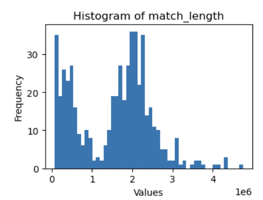
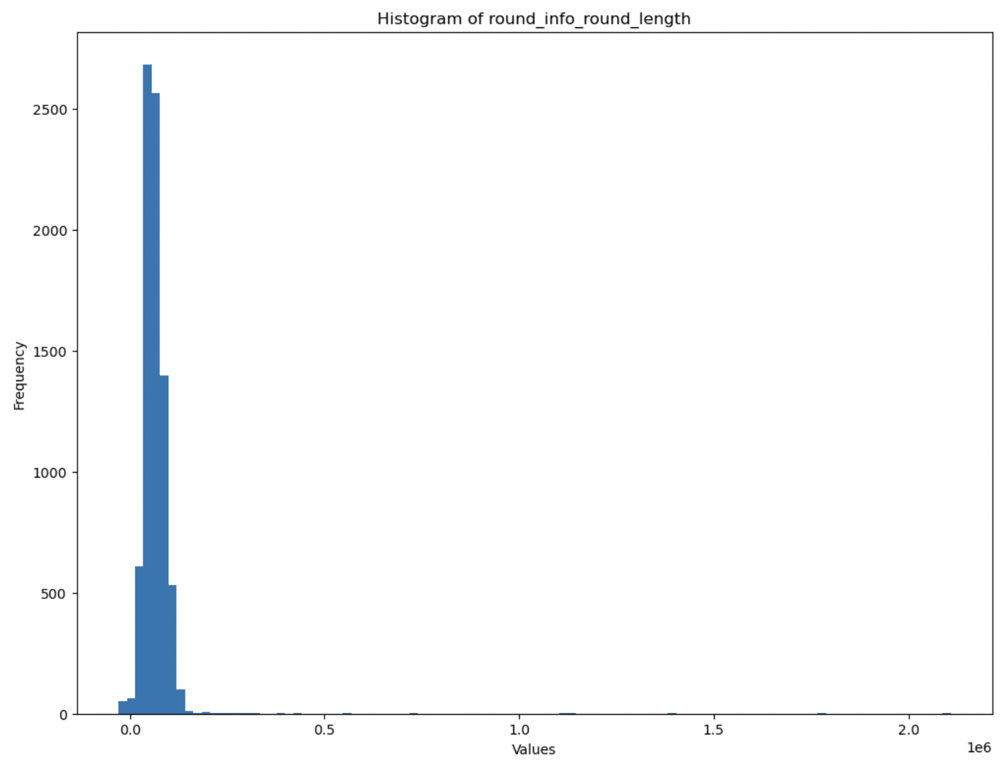

# Preprocessing
This project required extensive data preperation. Some of the preprocessing is consistant across all the models, and other preprocessing is unique to that model.

## Preprocessing for all models/analysis
The data provided is originally in a heavily-nested JSON tree-based structure. The first layer of the tree is mostly summary information about the processing (for example when the match was processed, not relevant) and match-level information (for example, total eliminations in match). Early on in the project, I realized that match-level data was too high-level and didn't capture the nuances of the game required for my research questions. I also discovered that the data had mixed game-types. Some game-types are shorter than others, resulting in bi-modal feature distrobtisions due to the incosistant match length. 

To solve both these problems, I decided to "normalize" the data by round. Rather than looking at match level, I would look at the round level (each row of my data would be a round rather than a match). This also allowed the mixed-gametypes to be comparable.

### Parsing
Since the higher levels of the data-tree were essentailly summaries of the deeper levels, in order to extract the information I needed I decided to start my parsing at the "source", the `'statistics'` node. I also maintained the `'user_id'` information in case it became relevant in the future. All of this preprocessing is done in `parsing/norm_round_spikesplit.py` abd `preprocess/ability_remap.py`. The process is as follows:

#### Flattening
1. Dropped the all cols besides 'statistics' and 'user_id'
2. Flattened the stats col by 1 level
    - Removed cols from the match perspective, such as 'totals' and 'result'
    - Even though 'map' is from match perspective, I need it so I am adding it in (similar to userID)
    - Removed 'allies_onscreen', 'opponents_onscreen', and 'detections_totals' (I think it is possible to engineer something from these columns, but this was an inconsistantly collected feature so I dropped it)
3. Flattened the player_ids col by 1 level
    - Gets all the teammates and opponents, as well as maps the 'player' to an ally (see the "Re-mapping active player" section below)
4. Flattened the round_info/round_totals cols by 1 level
    - This is where the DF expands into rounds being the rows instead of matches being the rows

#### Collecting features
The main parsing code happens during the 3rd "flattening" process (step 4 above). There are several helper functions as the data strucute frequntly changes. `def calculate_metrics` handles splitting the metrics based on the planting of the spike (see "Pre-Post spike plant" section below). `def calculate_longest_duration` handles calculating the longest inventory duration. `def calculate_ability_usage` handles calculating when an ability was actually used, since the data only includes if a user has an ability charge.

The rest of the code is highty specific to the feature (again due to the changing data structure). `norm_round_spikesplit.py` is extensitvly commented, so here I will only explain at a high-level. The goal of the parsing is to compress the data into a format that is usable for modeling. For all of the nodes, an event is marked with a timestamp when there is a change in value. For example, if you use an ability, your ability charge will go down by 1. The challenge is that not all players have the same information. Ability is restricted to the active player. However health is known across the team. Therefore, each of these data points need to be carefuly handled so the resulting vector has 0s where appropriate, or does not include that feature if it is not captured. 

Since this is time-series data, I calculated averages, totals, and max change for each of the features over the period of the round. 

#### Pre-Post spike plant
As mentioned above, originally I was just taking an average, total, and max change for the entire round. I found that whether or not the spike had been planted in a round seemed to be an importnat feature. So, I decided to increase the "time resolution" of the data by calculating those same metrics pre-spike plant, and post-spike plant. If no spike was planted, it is all pre-spike. This required me to first parse the data to collect the spike information, then do a second pass where I assign the values accorindlty.

#### Unique features
I also created some unique features. After talking with the Omnic team and doing my own resaerch online, I determined that certain aspects of the game were very important. One such aspect was movement around the map. Some players take on roles such as "scouts", that are responsible for moving around and learning information. Other players take on roles such as "anchors", which are responsible for defening sites. I hypothiesed that players may have differnet movment levels, and I wanted to capture this at a high-level. So, I developed the `% map covered` feature which takes in the current map, avalible places on a that map, places the player visisted, and then produces a percentage. I also created a feature `movement %` which provideds an esitmate of how many regions a player is corssing. If a player is moving back and forth between 2 areas, that is a low number. If the player is moiving across many areas, that is a high number.

### Ability re-mapping
Abilities are also a huge aspect of the game. As discussed above, the data tracked if an ability is charged (and after my pre-processing if an ability is used) but didn't provide any information as to what that ability does. So, (again in collaboration with the Omnic team and online resarech) I created a document `preprocess/abilities.csv` that categorizes the abilites based on their effect according to an agent's kit. For example, Jett is a "selfish" agent whos abilites are fully centered around helping herself do more damage and cover more ground. Of course, she is still a great help to her team when played correctly as a "entry fragger" (someone who runs in enemy teritory and creates openings for the rest of the team). Her abilies are generally mapped to "damage_for_self". A differnet agent, Sage, is much more supportive. She is one of the few healers in the game, so her abilites are mapped to 'healing' as well as 'crowd_control_team' since she can manilupate sightlines with her smokes. I followed this process for each agent, mapping their abilities to categories. I then used that mapping as a "look-up table" and combined it with my current dataframe to enhance the feature space (this process is done in `preprocess/ability_remap.py`) 

#### Re-mapping active player
The last major stumbling block for the data parsing is the active player. In the data, the "active player" can be mapped to 0,1,2,3 or 4. This means that the infomration avalible for "ally1" is different between the rounds. The last part of the processing handles this by re-naming the "active player" for that round to self, and the remaining allies are re-mapped accordinly. This creates a consistant/comparable rounds.

#### Cleaning
Finally, the gun attributes had a miss-label so I fixed that. And, there were a couple rows with missing information so I dropped those (it wasn't a significant number).

## Preprocessing for win/loss classification models
After parsing and cleaning the data, `win_loss/win_loss_data_preprocessing.py` takes the data and prepares it for the Win/Loss classification models. This entails dropping some irrelevant columns (`['player','round_number']`), re-mapping the true/false strings to 1 and 0, and one-hot encoding the other categorial features (`'map','self_character','ally4_character','ally1_character','ally2_character','ally3_character','opponent5_character', 'opponent6_character','opponent7_character','opponent8_character','opponent9_character','round_info_ally_side','self_longest_inv_state','self_longest_gun_primary','self_longest_gun_secondary','self_post_spike_longest_inv_state','self_pre_spike_longest_inv_state','self_post_spike_longest_gun_secondary','self_pre_spike_longest_gun_secondary','self_post_spike_longest_gun_primary','self_pre_spike_longest_gun_primary']`). I also added a feature to capture round length (`['round_info_round_length']`). This script outputs a csv per dataset, and a combined csv for all the datasets.

## Preprocessing for role classification models
The preprocessing for the role classification models (`roles/valorant_role_data_preprocessing.py` and `roles/cluster_role_data_preprocessing.py`) is simialr to the Win/Loss classification model, with small differences.

### Valorant roles
The preprocessing for the Valorant roles drops the same columns, re-maps the boolean features, adds the round length feature, and one-hot encodes almost all the same cateogical features besides `'self_character'`. This is becuase for this analysis, we actually take `'self_character'` and re-map it to the four valorant classes (this is our target). This mapping is defined by the Valorant game, where 0 represents Sentinel, 1 represents Controller, 2 represents Duelist, and 3 represents Initiatior.

mapping = {'killjoy':0, 'cypher':0, 'sage':0,'chamber':0, 
           'brimstone':1, 'omen':1,'viper':1,'astra':1,'harbor':1,
          'jett':2, 'phoenix':2,'raze':2, 'reyna':2,'neon':2, 'yoru':2,
           'gekko':3, 'breach':3, 'fade':3, 'kay/o':3, 'skye':3,'sova':3}`

Then, same as Win/Loss classification preprocessing, I output a csv per dataset, and a combined csv for all the datasets.

### Cluster roles
TBD