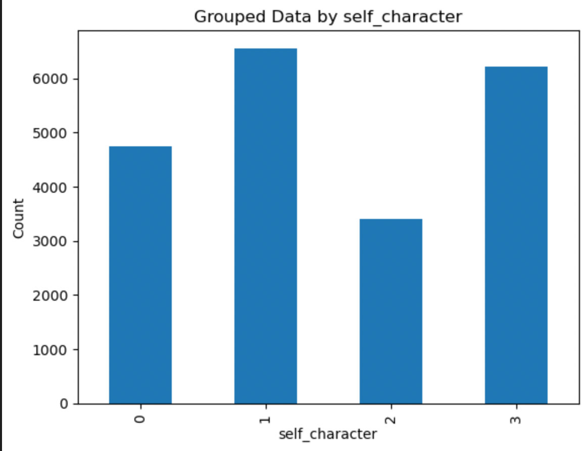

# Roles in Valorant
The purpose of this document is to walk through the second batch of research questions related to roles in Valorant.

## Questions and additional context
- A Valorant agent's "kit" refers to the character design (an agents abilities, features, strengths, weaknesses)
- In Valorant, the 19 agents are automatically organized into 4 classes: sentinels, controllers, duelists, and initiators
    - These classes have general attributes, but some are more flexible than others.
        - For example, duelists are generally offensive, damage focused agents while sentinels are more supportive/defensive. Some duelist agents have a ridgid kit that can only be played offensively, while others are flexible and could be supportive despite being a "duelist".
- The Valorant community has loosely defined more specific "roles" that go beyond the predefined classes and resemble positions in sports
    - For example, a commonly-recommended strategy is to play as a "entry-fragger", which is a more specific role than than "duelist".
    - More information: [abilities](https://github.com/sophiacofone/omnic_ml/blob/main/preprocess/abilities.csv )
- Hypothesis: it possible to classify Valorant players into "classes" or "roles" based solely on game-play data
    - Sentinels, controllers, duelists, and initiators truly use different strategies and gameplay mechanics that can be used as features to predict the class
    - There are more specific classes, called roles, that are more informative to how users actually play
        - More information: [specific roles](https://github.com/sophiacofone/valorant_omnic/blob/main/roles/valorant_agent.pdf)

## Data & Pre-processing
Refer to the [preprocess section](https://github.com/sophiacofone/omnic_ml/edit/main/preprocess/preprocess.md) for information on overall data preprocessing. In addition to these steps, `roles/valorant_role_data_preprocessing.py` drops some irrelevant columns (`['player','round_number']`), re-maps the true/false strings to 1 and 0, and one-hot encodes the other categorial features (`'map','self_character','ally4_character','ally1_character','ally2_character','ally3_character','opponent5_character', 'opponent6_character','opponent7_character','opponent8_character','opponent9_character','round_info_ally_side','self_longest_inv_state','self_longest_gun_primary','self_longest_gun_secondary','self_post_spike_longest_inv_state','self_pre_spike_longest_inv_state','self_post_spike_longest_gun_secondary','self_pre_spike_longest_gun_secondary','self_post_spike_longest_gun_primary','self_pre_spike_longest_gun_primary']`). I added a feature to capture round length (`['round_info_round_length']`). Finally, I encoded the valorant agents into their respective classes. `win_loss/valorant_role_data_preprocessing.py`outputs a csv per dataset, and a combined csv for all the datasets. These csvs are the input data for the modeling below. The combined dataframe has 28959 rows × 522 columns.

## Feature engineering
One of the critical "information spaces" for this analysis is abilities. In Valorant, abilities are what allow for smoke screens, increased speed, healing, information gathering, etc. The original data simply tracked if an ability was used without any information as to what that ability actually did during the game. To fix this, I created additional features that enhance the ability information. This proved to be quite successful, increasing model accuracy by 10%. Please see the [preprocess document, Ability Enhancement section](https://github.com/sophiacofone/omnic_ml/edit/main/preprocess/preprocess.md) for more information. The data presented below is using this "enhanced" feature space.

### Class Imbalance
My target was relatively balanced. Class 0 and 3 could have been higher, but it didn't seem to effect the F1 scores (all the classes were similar to predict)

## Is it possible to classify Valorant players into "classes" based solely on game-play data?
Why should we start with this question rather than the more interesting role/position question? Two reasons:
1. It is an easier question with labels (supervised), that acts as a "proxy" for our harder question
2. If it is possible to classify based on gameplay, then it is more likely that our data is "good" enough to answer the harder question

## Decision Tree Model
During the first phase of the research project, I had success using both decision trees and logistic regression for the win/loss classification problem. Since we still care a lot about features/interpretability, I stuck with decision trees for this question.

For more information on how deciion trees work for this data, see [win loss section](https://github.com/sophiacofone/omnic_ml/blob/main/win_loss/win_loss.md)

### Results
#### Classifying Valorant Agents: All data
I created a [results csv](https://github.com/sophiacofone/omnic_ml/tree/main/roles/dtree_csv_feature_results_class) of the features and their importances.

##### Metrics: Tuned, no pruning
| Metric         | Result   |
| -------------- | -------- |
| Train Accuracy | 100%      |
| Test Accuracy  | 96%      |
| Train F1       | 100%      |
| Test F1        | 96%      |
##### Metrics: After pruning (max 20 depth)
| Metric         | Result   |
| -------------- | -------- |
| Train Accuracy | 96%      |
| Test Accuracy  | 93%      |
| Train F1       | 93%      |
| Test F1        | 93%      |
##### Top 20 important features combined
| Feature                                  | Importance |
|------------------------------------------|----------|
|   user_id                                |   0.11   |
|   self_pre_spike_total_ability_usage_3   |   0.08   |
|   pre_spike_information_used             |   0.07   |
|   pre_spike_damage_for_self_used         |   0.06   |
|   pre_spike_crowd_control_vision_used    |   0.05   |
|   pre_spike_damage_for_team_used         |   0.03   |
|   pre_spike_shield_used                  |   0.03   |
|   self_pre_spike_total_ability_usage_1   |   0.02   |
|   ally2_character_killjoy                |   0.02   |
|   pre_spike_crowd_control_mobility_used  |   0.02   |
|   pre_spike_crowd_control_general_used   |   0.02   |
|   opponent6_character_jett               |   0.02   |
|   opponent8_character_raze               |   0.02   |
|   self_pre_spike_total_ability_usage_2   |   0.02   |
|   self_pre_spike_map_covered             |   0.02   |
|   pre_spike_healing_used                 |   0.01   |
|   ally3_character_skye                   |   0.01   |
|   opponent8_character_cypher             |   0.01   |
|   ally3_character_killjoy                |   0.01   |
|   ally3_pre_spike_avg_health             |   0.01   |

After running this initial analysis, I immediately knew I had to exclude user_id. While it is interesting that the best predictor for class is user (indicates that users have a preference for class), I wanted to have a model independent of user.

#### Classifying Valorant Agents: No user ID
##### Metrics: Tuned, no pruning
| Metric         | Result   |
| -------------- | -------- |
| Train Accuracy | 100%      |
| Test Accuracy  | 96%      |
| Train F1       | 100%      |
| Test F1        | 96%      |
##### Metrics: After pruning (max 18 depth)
| Metric         | Result   |
| -------------- | -------- |
| Train Accuracy | 93%      |
| Test Accuracy  | 91%      |
| Train F1       | 93%      |
| Test F1        | 91%      |
##### Top 20 important features combined
| Feature                                  | Importance              |
|------------------------------------------|-------------------------|
|   self_pre_spike_total_ability_usage_3   |   0.09  |
|   pre_spike_information_used             |   0.07   |
|   pre_spike_damage_for_self_used         |   0.06   |
|   pre_spike_crowd_control_vision_used    |   0.05  |
|   self_pre_spike_total_ability_usage_1   |   0.04   |
|   pre_spike_shield_used                  |   0.04   |
|   pre_spike_damage_for_team_used         |   0.04   |
|   pre_spike_crowd_control_general_used   |   0.02  |
|   pre_spike_crowd_control_mobility_used  |   0.02 |
|   ally2_character_killjoy                |   0.02  |
|   self_pre_spike_total_ability_usage_2   |   0.02   |
|   self_pre_spike_map_covered             |   0.02  |
|   ally1_pre_spike_total_health_loss      |   0.02   |
|   pre_spike_healing_used                 |   0.01   |
|   map_Pearl                              |   0.01 |
|   opponent7_character_killjoy            |   0.01  |
|   map_Bind                               |   0.014  |
|   ally4_character_reyna                  |   0.01  |
|   ally3_character_skye                   |   0.01  |
|   ally4_pre_spike_avg_health             |   0.01  |

Similarly, I also wanted to exclude the opponents and allied agent information. The model choosing these features indicates that players choose their class based on their teammates class, but again I felt a more interesting analysis would be independent of this.

#### Classifying Valorant Agents: No user ID, opponent characters
##### Metrics: Tuned, no pruning
| Metric         | Result   |
| -------------- | -------- |
| Train Accuracy | 100%      |
| Test Accuracy  | 85%      |
| Train F1       | 100%      |
| Test F1        | 85%      |
##### Metrics: After pruning (max 15 depth)
| Metric         | Result   |
| -------------- | -------- |
| Train Accuracy | 88%      |
| Test Accuracy  | 82%      |
| Train F1       | 82%      |
| Test F1        | 82%      |
##### Top 20 important features combined
| Feature                                  | Importance              |
|------------------------------------------|-------------------------|
|   self_pre_spike_total_ability_usage_3   |   0.11  |
|   pre_spike_information_used             |   0.10   |
|   pre_spike_damage_for_self_used         |   0.07  |
|   self_pre_spike_total_ability_usage_1   |   0.07   |
|   pre_spike_crowd_control_vision_used    |   0.06   |
|   pre_spike_shield_used                  |   0.05   |
|   pre_spike_damage_for_team_used         |   0.05  |
|   pre_spike_crowd_control_mobility_used  |   0.03  |
|   ally1_pre_spike_avg_health             |   0.03 |
|   pre_spike_crowd_control_general_used   |   0.03   |
|   self_pre_spike_total_ability_usage_2   |   0.03    |
|   self_pre_spike_map_covered             |   0.02   |
|   pre_spike_healing_used                 |   0.02  |
|   map_Pearl                              |   0.02   |
|   ally3_pre_spike_avg_health             |   0.02  |
|   self_pre_spike_avg_ammo_reserve        |   0.02  |
|   map_Bind                               |   0.02  |
|   map_Fracture                           |   0.01  |
|   map_Lotus                              |   0.01  |
|   self_pre_spike_max_loadout_value_loss  |   0.01   |
|   self_pre_spike_max_loadout_value_loss  |   0.01   |

Finally, I excluded map information after this analysis. Following the same logic, map features indicate that players choose roles based on maps. Interesting, but I want to eliminate player "choices".

#### Classifying Valorant Agents: No user ID, opponent characters, or map
##### Metrics: Tuned, no pruning
| Metric         | Result   |
| -------------- | -------- |
| Train Accuracy | 98%      |
| Test Accuracy  | 84%      |
| Train F1       | 98%      |
| Test F1        | 84%      |
##### Metrics: After pruning (max 20 depth)
| Metric         | Result   |
| -------------- | -------- |
| Train Accuracy | 84%      |
| Test Accuracy  | 79%      |
| Train F1       | 79%      |
| Test F1        | 79%      |
##### Top 20 important features combined
| Feature                                    | Importance              |
|--------------------------------------------|-------------------------|
|   self_pre_spike_total_ability_usage_3     |   0.12   |
|   pre_spike_information_used               |   0.11  |
|   pre_spike_damage_for_self_used           |   0.08  |
|   self_pre_spike_total_ability_usage_1     |   0.07  |
|   pre_spike_crowd_control_vision_used      |   0.07   |
|   pre_spike_shield_used                    |   0.06   |
|   pre_spike_damage_for_team_used           |   0.04   |
|   pre_spike_crowd_control_mobility_used    |   0.04  |
|   self_pre_spike_total_ability_usage_2     |   0.04   |
|   pre_spike_healing_used                   |   0.03  |
|   self_pre_spike_map_covered               |   0.03  |
|   pre_spike_crowd_control_general_used     |   0.03  |
|   ally1_pre_spike_total_health_loss        |   0.02  |
|   ally3_pre_spike_avg_health               |   0.02  |
|   self_pre_spike_avg_ammo_reserve          |   0.02  |
|   self_pre_spike_movement_metric           |   0.01  |
|   self_pre_spike_total_loadout_value_loss  |   0.01   |
|   self_pre_spike_total_ability_usage_4     |   0.01  |
|   ally1_pre_spike_avg_health               |   0.01
|   ally4_pre_spike_avg_health               |   0.01 |

After removing all those features, it is clear that the most important features for classifying players into classes is abilities (usage and type). map_covered, health, ammo, and loadout value were also useful features.

## Are there other classes/roles that are more informative of how users actually play?
After hypothesizing what these roles might be, and doing strategic feature engineering to try and provide as much of that information to my models as I could, I decided to try and tackle this problem via unsupervised clustering.

My reasoning was, if I can form clusters with the data, we can see if those clusters align with some of the roles we might expect. During this exploration phase, I colored the points with the 4 Valorant classes. I expected to be able to see these points grouped together, perhaps with some additional clusters or overlapping clusters. Above, I provided an example of an "entry-fragger" role that is a more specific version of "Duelist". I thought that perhaps I would be able to divide the "Duelist" cluster into more specific groupings.

Because this is an unsupervised problem, this strategy would have relied on a subject-matter-expert to then observe the clusters to make the final classification.

Unfortunately, this ended up being challenging. Despite having classification success earlier in the project, the data was not forming good clusters with the methods I tried. I tried using PCA, Kernel PCA, and T-SNE. None of these methods created easily definable clusters. My reasoning behind why this might be happening is the nature of the data. The data is sparse, with many features being correlated and categorical, which could be challenging for distance-based clustering methods.

I tried significantly reducing the feature space (using features deemed important from the previous work done with the decision trees) to see if that helped. It did create some structure, but still no real clustering.

I am not sure at this point if the method is wrong, or if this data just isn't suitable for clustering. I would suggest the following in order to continue this analysis:

1. More data. It is possible that this "role" classification is subtle, therefore more data might be able to bring out this relationship.
2. Labels. I attempted labeling the data, but this proved to be time-consuming and out-of-scope for this project. I also would like someone more knowledgeable about the "ground-truth".
3. Complete information space. Due to the nature of Omnic's data, we only have access to the full information space of the active player. Since so many of the roles rely on teammate information, I think having information about where teammates are, what abilities they used, etc. could be critical.

For the code used in this exploration, please refer to [clustering](https://github.com/sophiacofone/omnic_ml/blob/main/roles/cluster_exploration.ipynb).
