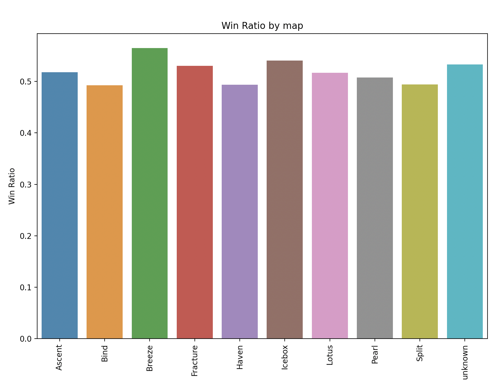
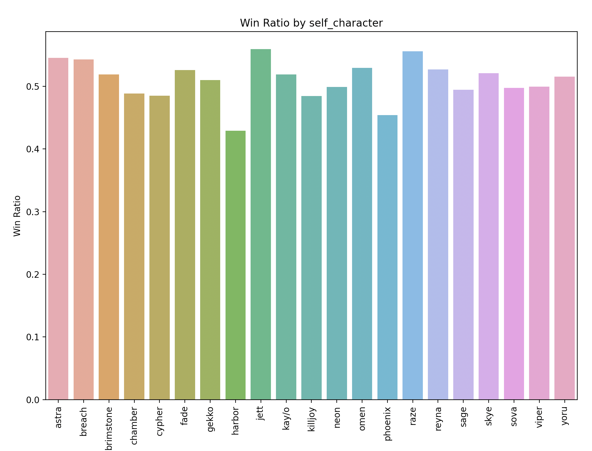
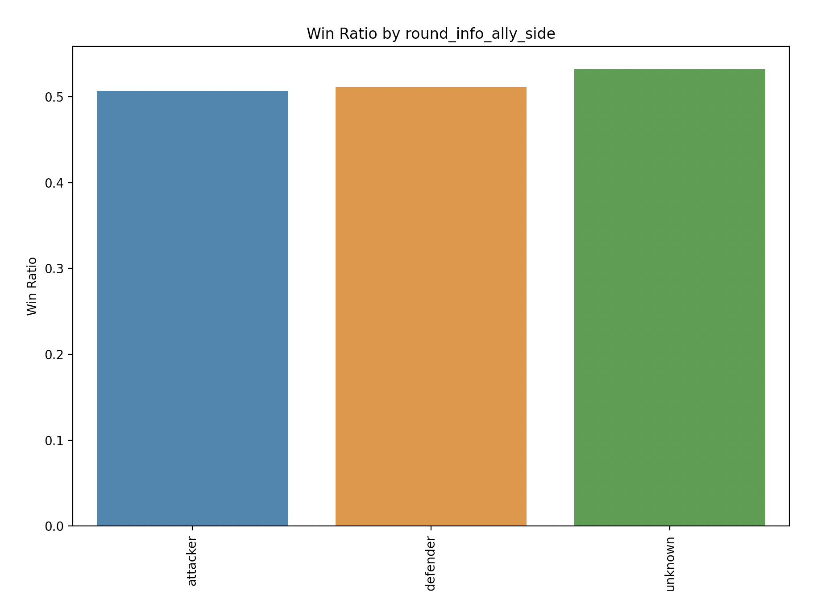
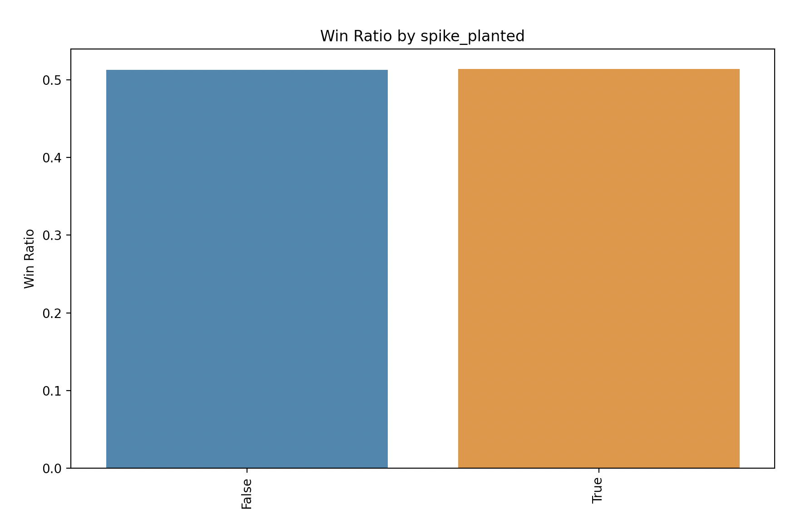
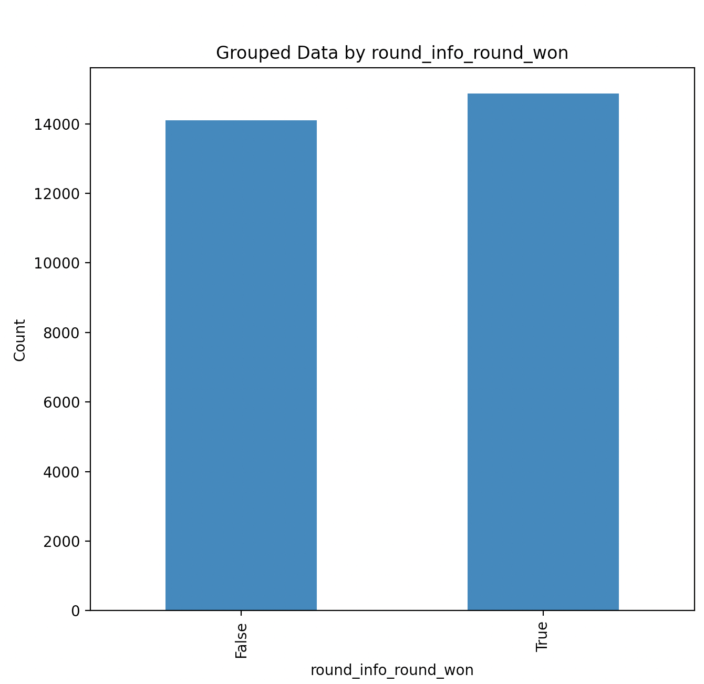
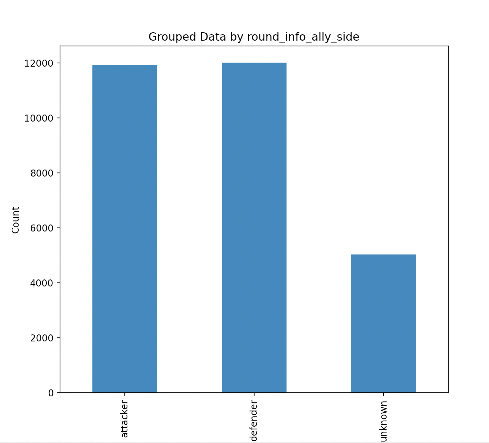

# Winning Rounds in Valorant
The purpose of this document is to walk through the first batch of research questions related to winning rounds in Valorant.

## Questions and additional context
- To win a match of valorant, you need to win 13 rounds (5 rounds if the gametype is swiftplay)
    - There are several ways to win a round. The options are dependent on if you are attacking or defending. 
        - If you are on the attacking side, you win by either planting the spike on the opposing side and it detonates, or you eliminate all opponents.
        - If you are on the defending side, you win by either deativating a planted spike, eliminating all opponents, or just suriving without the spike being planted.
- Hypothesis: depending on if you are attacker or defender, and if the spike has been planted or not, your strategy will change
    - If you are an attacker and the spike is not planted, should focus on planting the spike.
    - If you are an attacker and the spike is planted, all teammates should focus on defending the spike and killing the other team.
    - If you are a defender and the spike is not planted, the team should focus on kills and defending the site.
    - If you are a defender and the spike is planted, the team should focus on kills/deativating the spike.

## Are there certain characters, maps that are more likely to lead to a win?
This is more of an EDA question. A well-designed game would not have one map that was siginificaly easier to win on, or one character that was dominant over the rest. To assess this, I grouped the data by feature and calculated the win-ratio.

I found the map types and agents to be balanced. Accodrding to this data, there does not seem to be any one map or agent that was "easier" to win with. I also checked the win/loss ratio for attackers vs defenders, as well as spike planted vs not. Like the map and agent, these visuals indicate that it is not "easier" to be an attacker or defender, or that its always "better" to plant the spike rather than just eliminating the whole opposing team. 

This is not a suprising result. In fact, this indicates that what it takes to win a round of Valorant is more strategic and subtle than simply picking the best agent (for example). Individual players may still have maps or agents that consistantly give them better outcomes. However, this is likely due to preference/practice rather than the agent/map itself being inherently better.

Refer to the [EDA section](https://github.com/sophiacofone/omnic_ml/blob/main/EDA/eda.md) for more information on the EDA process and how these visuals were generated.

## What should player's focus on to win a round of Valorant?
To answer this question, one strategy is to build a classifier that can accuratley predict wins and losses. Then, we can examine the feature importances/coefficents and determine which factors are most influential in determining match outcomes. Since we care less about the actual prediction and more about the features, a good choice would be to work with with models like decision trees and logistic regression since these models can be easily interpreted.

### Data & Preprocessing
Refer to the [preprocess section](https://github.com/sophiacofone/omnic_ml/edit/main/preprocess/preprocess.md) for information on overall data preprocessing. In addition to these steps, `win_loss/win_loss_data_preprocessing.py` drops some irrelevant columns (`['player','round_number']`), re-maps the true/false strings to 1 and 0, and one-hot encodes the other categorial features (`'map','self_character','ally4_character','ally1_character','ally2_character','ally3_character','opponent5_character', 'opponent6_character','opponent7_character','opponent8_character','opponent9_character','round_info_ally_side','self_longest_inv_state','self_longest_gun_primary','self_longest_gun_secondary','self_post_spike_longest_inv_state','self_pre_spike_longest_inv_state','self_post_spike_longest_gun_secondary','self_pre_spike_longest_gun_secondary','self_post_spike_longest_gun_primary','self_pre_spike_longest_gun_primary']`). Finally, I added a feature to capture round length (`['round_info_round_length']`). `win_loss/win_loss_data_preprocessing.py`outputs a csv per dataset, and a combined csv for all the datasets. These csvs are the input data frames for the modeling below. The combined dataframe has 28959 rows × 542 columns.

## Logistic Regression Model
Logistic regression is usually a good starting point for binary classification problems. As mentioned above, its primary "pro" is that it is simple and easy to interpret. It is also fast, easy to implement, and isn't really prone to overfititng. However, its main downside is that it can be **too** simple. It assumes the data has a linear relationship with the outcome. Therefore, it works best when the data is linearly seperable. Logistic regression struggles to capture complex relationships due to this linealirty assumpotion.

The "goal" of logstic regression is to predict one of two outcomes based on the input features. The logistic function (sigmoid function) maps any number to a value between 0 and 1 (good for probabilities). 

Logistic function: -σ(z) = 1 / (1 + e^(-z))
- σ(z) is the output (probability) between 0 and 1.
- e is the base of the natural logarithm, approximately equal to 2.71828.
- z is the linear combination of the input features and their associated weights.
    - z = w0 * x0 + w1 * x1 + w2 * x2 + ... + wn * xn
    - w0, w1, w2, ..., wn are the coefficients (weights) associated with each feature.
    - x0, x1, x2, ..., xn are the corresponding feature values.

During training, the model finds the best values for the coefficients (weights) that minimize the error between the predicted probabilities and the actual class labels in the training data.

### Class Imbalance
Log reg is sensitive to class inbalance. My first step was to ensure my target was balanced.

### Feature Selection
Since we are ultimatly interseted in the **features** of this model, I decided to incoperate feature selection into this process. I first trained a logistic regression model using L1 regularizatoin. L1 regularization has the benefit of driving some feature weights to zero, effectivly excluding them from the model. Then, I used those features to create a new model using L2 regualrization. L2 regularization prevents overfitting and is less sensitive to outliers than L1. In both cases, I used cross validation to tune the "C" hyper parameter (controls the strength of the regularization). 

### Results
####  What should player's focus on to win a round of Valorant?: All data
I found using feature selection imporved the accuracy/F1 score of my model siginifantly. As mentioed above, I have over 500 features, and log reg does not do well with modeling complex relationships. Originally I used all the non-zero features returned by L1 regularization in my L2 model. My accuracy was only 72%. Including only the features above the median drasticly reduced the feature space and imrpoved the resulting L2 model to 94% accuracy and 0.94% F1 score on both classes. 

I created a dataframe/csv (`win_loss/df_coefs_logreg_all.csv`) of the features and their coefs. For binary logistic regression, we can interpret the **positive** coefs as increasing the likelihood of class 1 (winning). And, we can interpret the **negative** coefs as increasing the likelihood of class 0 (losing). The magnitude indicates the "importance" of the feature. 

##### Top 10 important features for predicting wins
| Feature                                  | Coef        |
| ---------------------------------------- | ----------- |
| all_opponent_dead                        | 1.9         |
| self_post_spike_total_ability_usage_4    | 1.4         |
| opponent4_post_spike_deaths              | 1.0         |
| ally3_post_spike_wallbangs               | 1.0         |
| self_post_spike_longest_gun_primary_odin | 0.9         |
| ally1_post_spike_ultimate_usage          | 0.9         |
| ally3_pre_spike_elims                    | 0.9         |
| self_pre_spike_longest_inv_state_melee   | 0.9         |
| self_pre_spike_map_covered               | 0.9         |
| opponent0_post_spike_deaths              | 0.8         |

##### Top 10 important features for predicting losses
| Feature                                      | Coef        |
| -------------------------------------------- | ----------- |
| opponent2_post_spike_elims                   | -1.5        |
| all_ally_dead                                | -1.4        |
| opponent1_post_spike_elims                   | -1.3        |
| ally1_character_harbor                       | -1.2        |
| post_spike_shield_used                       | -1.2        |
| opponent0_post_spike_elims                   | -1.2        |
| opponent4_post_spike_elims                   | -1.2        |
| opponent4_post_spike_elims                   | -1.2        |
| map_Breeze                                   | -1.2        |
| self_post_spike_longest_gun_primary_operator | -1.1        |

##### Top 10 important features combined
| Feature                               | Coef        |
| ------------------------------------- | ----------- |
| all_opponent_dead                     | 1.9         |
| opponent2_post_spike_elims            | -1.5        |
| self_post_spike_total_ability_usage_4 | 1.4         |
| all_ally_dead                         | -1.4        |
| opponent1_post_spike_elims            | -1.3        |
| ally1_character_harbor                | -1.2        |
| post_spike_shield_used                | -1.2        |
| opponent0_post_spike_elims            | -1.2        |
| opponent4_post_spike_elims            | -1.2        |
| opponent4_post_spike_elims            | -1.2        |

####  What should player's focus on to win a round of Valorant?: Attacking vs Defending
Now that we have an idea of what it takes to win a round of valorant from a high level, I thought it would be interesting to explore if these features change depending on some addiitonal criteria. I decided to use a "stratified analysis" approach, where I devide my data into groups and seperatly preform my analysis and investigate the differences (if there are any).

First, I devided my data into "attacker" and "defender" (I removed the unknown rows).

## Decision Tree Model
Even though I acheied good results with the simple logistic regression models, I wanted to also explore a non-linear classifier like decision trees. cision tree to find which features split the data best (which would suggest they are significant in determining wins and losses),

Decision trees work by ...
#### Permutation Importance
Directly measures variable importance by observing the effect on model accuracy of randomly shuffling each predictor variable. It's a more robust way than merely looking at feature importance, especially when features are correlated.

#### Partial Dependence Plots (PDPs
Plots that show how a feature affects predictions. They could help to see whether the relationship between the target and a feature is linear, monotonic, or more complex.

## Does this change depending on if you are attacking or defending?

### Does this change depending on what point of the match you are in (pre or post spike plant)?

### Does this change depending on what "role" you are playing as?