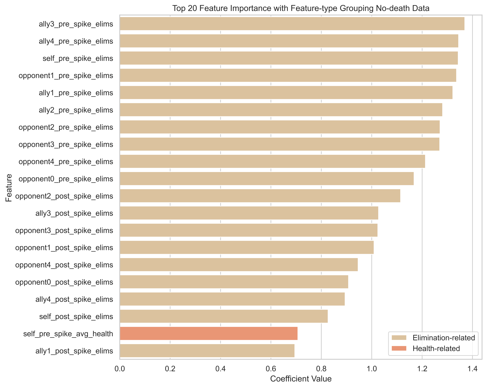
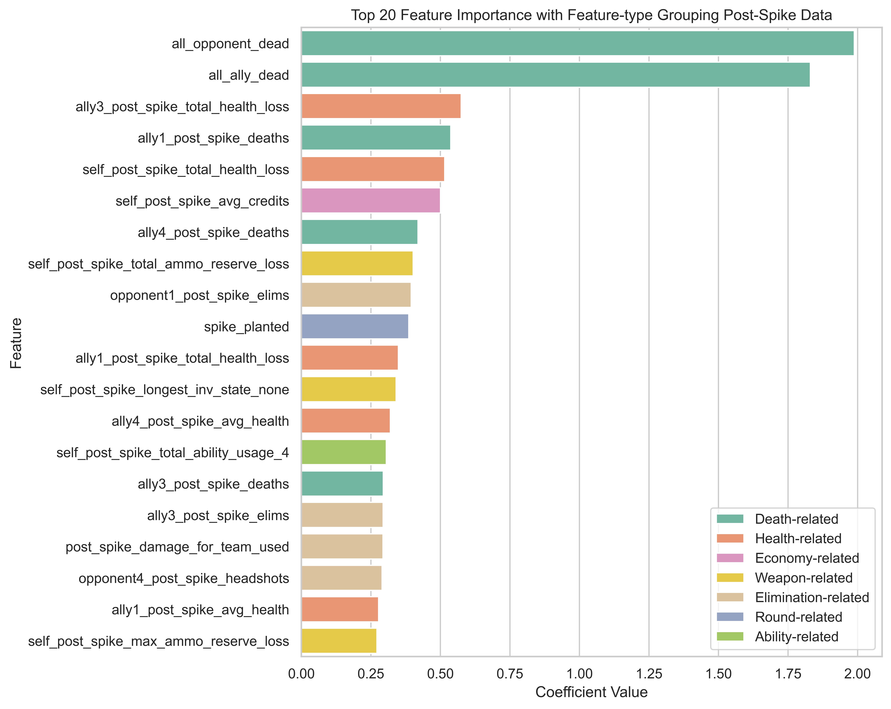
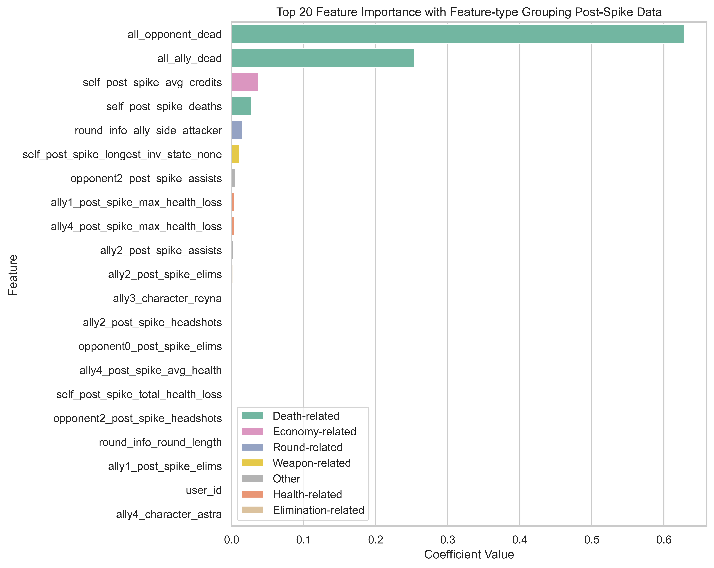
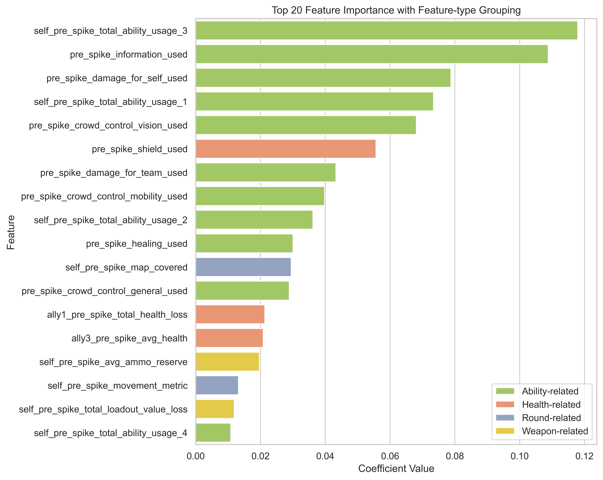

# Winning Rounds in Valorant
The purpose of this document is to walk through the first batch of research questions related to winning rounds in Valorant.

## Questions and additional context
- To win a match of Valorant, you need to win 13 rounds (5 rounds if the game-type is swiftplay).
- There are several ways to win a round. The options are dependent on if you are attacking or defending.
    - If you are on the attacking side, you win by either planting the spike on the opposing side and it detonates, or you eliminate all opponents.
    - If you are on the defending side, you win by either deactivating a planted spike, eliminating all opponents, or just surviving without the spike being planted.
- Hypothesis: depending on if you are attacker or defender, and if the spike has been planted or not, your strategy will change
    - If you are an attacker and the spike is not planted, you should focus on planting the spike.
    - If you are an attacker and the spike is planted, all teammates should focus on defending the spike and killing the other team.
    - If you are a defender and the spike is not planted, the team should focus on kills and defending the site.
     If you are a defender and the spike is planted, the team should focus on kills/deactivating the spike.

## Are there certain characters, maps that are more likely to lead to a win?
A well-designed game would not have one map that was significantly easier to win on, or one character that was dominant over the rest. To assess this, I grouped the data by feature and calculated the win-ratio.

 
 

I found the map types and agents to be balanced. According to this data, there does not seem to be any one map or agent that was "easier" to win with. I also checked the win/loss ratio for attackers vs defenders, as well as spike planted vs not. Like map and agent, these visuals indicate that it is not "easier" to be an attacker or defender, or that it's always "better" to plant the spike rather than just eliminating the whole opposing team.

This is not a surprising result. In fact, this indicates that what it takes to win a round of Valorant is more strategic and subtle than simply picking the best agent (for example). Individual players may still have maps or agents that consistently give them better outcomes. However, this is likely due to preference/practice rather than the agent/map itself being inherently better.

Refer to the [EDA code](https://github.com/sophiacofone/omnic_ml/blob/main/EDA/eda.py) for more information on the EDA process and how these visuals were generated.

## What should players focus on to win a round of Valorant?
To answer this question, one strategy is to build a classifier that can accurately predict wins and losses. Then, we can examine the feature importances/coefficients and determine which factors are most influential in determining match outcomes. Since we care less about the actual prediction and more about the features, a good choice would be to work with with models like decision trees and logistic regression since these models can be easily interpreted.

### Data & Preprocessing
Refer to the [preprocess section](https://github.com/sophiacofone/omnic_ml/edit/main/preprocess/preprocess.md) for information on overall data preprocessing. In addition to these steps, `win_loss/win_loss_data_preprocessing.py` drops some irrelevant columns (`['player','round_number']`), re-maps the true/false strings to 1 and 0, and one-hot encodes the other categorial features (`'map','self_character','ally4_character','ally1_character','ally2_character','ally3_character','opponent5_character', 'opponent6_character','opponent7_character','opponent8_character','opponent9_character','round_info_ally_side','self_longest_inv_state','self_longest_gun_primary','self_longest_gun_secondary','self_post_spike_longest_inv_state','self_pre_spike_longest_inv_state','self_post_spike_longest_gun_secondary','self_pre_spike_longest_gun_secondary','self_post_spike_longest_gun_primary','self_pre_spike_longest_gun_primary']`). Finally, I added a feature to capture round length (`['round_info_round_length']`). `win_loss/win_loss_data_preprocessing.py`outputs a csv per dataset, and a combined csv for all the datasets. These csvs are the input data for the modeling below. The combined dataframe has 28959 rows × 542 columns.

Please see [win_loss_data_preprocessing](https://github.com/sophiacofone/omnic_ml/blob/main/win_loss/win_loss_data_preprocessing.py) for the w/l-specific preprocessing code.

## Logistic Regression Model
Logistic regression is usually a good starting point for binary classification problems. As mentioned above, its primary "pro" is that it is simple and easy to interpret. It is also fast, easy to implement, and isn't really prone to overfitting. However, its main downside is that it can be **too** simple. It assumes the data has a linear relationship with the outcome. Therefore, it works best when the data is linearly separable. Logistic regression struggles to capture complex relationships due to this linearity assumption.

The "goal" of logistic regression is to predict one of two outcomes based on the input features. The logistic function (sigmoid function) maps any number to a value between 0 and 1 (good for probabilities).

Logistic function: -σ(z) = 1 / (1 + e^(-z))
- σ(z) is the output (probability) between 0 and 1.
- e is the base of the natural logarithm, approximately equal to 2.71828.
- z is the linear combination of the input features and their associated weights.
    - z = w0 * x0 + w1 * x1 + w2 * x2 + ... + wn * xn
    - w0, w1, w2, ..., wn are the coefficients (weights) associated with each feature.
    - x0, x1, x2, ..., xn are the corresponding feature values.

During training, the model finds the best values for the coefficients (weights) that minimize the error between the predicted probabilities and the actual class labels in the training data.

Please see [win_loss_model](https://github.com/sophiacofone/omnic_ml/blob/main/win_loss/win_loss_model.py) for the modeling code.

### Class Imbalance
Log reg is sensitive to class imbalance. My first step was to ensure my target was balanced.

### Feature Selection
Since we are ultimately interested in the **features** of this model, I decided to incorporate feature selection into this process. I first trained a logistic regression model using L1 regularization. L1 regularization has the benefit of driving some feature weights to zero, effectively excluding them from the model. I decided to further eliminate features by only including features with coefs that were above the median value. Then, I used those features to create a new model using L2 regularization. L2 regularization prevents overfitting and is less sensitive to outliers than L1. In both cases, I used cross validation to tune the "C" hyper parameter (controls the strength of the regularization).

### Results

####  What should player's focus on to win a round of Valorant?: All data
Refer to [results section](https://github.com/sophiacofone/omnic_ml/tree/main/win_loss/logreg_csv_feature_results) for all of the generated feature coefs. The magnitude indicates the "importance" of the feature.

Please see [win_loss_applied](https://github.com/sophiacofone/omnic_ml/blob/main/win_loss/win_loss_applied.py) for the modeling inference.

##### Metrics
| Metric         | Result   |
| -------------- | -------- |
| Train Accuracy | 95%      |
| Test Accuracy  | 95%      |
| Train F1       | 95%      |
| Test F1        | 95%      |

##### Top 20 important features combined

These features indicate that from an overall perspective, your team not dying, your opponents dying, and health are the most important predictor for winning rounds of Valorant. This may seem obvious, but in Valorant there are multiple ways to win with elims/deaths being only one of them. These results could justify playing more "defensively", i.e. not dying versus trying to get lots of elims by taking risky moves.

#### No deaths?
I wanted to also see what without using deaths as a feature, could the model still predict well and what features it would pick.

##### Metrics
| Metric         | Result   |
| -------------- | -------- |
| Train Accuracy | 95%      |
| Test Accuracy  | 94%      |
| Train F1       | 95%      |
| Test F1        | 94%      |

##### Top 20 important features combined - no deaths

The model does still predict well, but this time it appears to be focusing on elims rather than deaths. 

####  What should player's focus on to win a round of Valorant?: Attacking vs Defending
Now that we have an idea of what it takes to win a round of valorant from an overall level, I thought it would be interesting to explore if these features change depending on some additional criteria. I decided to use a "stratified analysis" approach, where I divide my data into groups and separately perform my analysis and investigate the differences (if there are any).

First, I divided my data into "attacker" and "defender" (I removed the unknown rows).

Then, I re-ran my process using `win_loss/csv/'wl_alldf_prepro_data_attack.csv` and `win_loss/csv/'wl_alldf_prepro_data_defend.csv` producing `win_loss/df_coefs_logreg_attack.csv` and `win_loss/df_coefs_logreg_defenc.csv`.

Please see [stratified_df](https://github.com/sophiacofone/omnic_ml/blob/main/win_loss/stratified_df.py) for the devided dataframde code.

##### Metrics
| Metric         | Result   |
| -------------- | -------- |
| Train Accuracy | 97%      |
| Test Accuracy  | 96%      |
| Train F1       | 97%      |
| Test F1        | 96%      |

##### Top 20 important features combined: Attack

Similar to the analysis above, we see deaths/not dying as the best thing to focus on. However, we do see some ability use here and a round-length related feature.

##### Metrics
| Metric         | Result   |
| -------------- | -------- |
| Train Accuracy | 96%      |
| Test Accuracy  | 95%      |
| Train F1       | 96%      |
| Test F1        | 96%      |

##### Top 20 important features combined: Defend

Here, we see some differences. Deaths/health is still the highest, but we start to see ammo, gun usage, ability usage, and elims.

####  What should player's focus on to win a round of Valorant?: Pre vs Post Spike plant

##### Metrics
| Metric         | Result   |
| -------------- | -------- |
| Train Accuracy | 92%      |
| Test Accuracy  | 91%      |
| Train F1       | 92%      |
| Test F1        | 91%      |

##### Top 20 important features combined: Pre-Spike

We still see deaths/health as big predictors, but with a lot more gun-related features.

##### Metrics
| Metric         | Result   |
| -------------- | -------- |
| Train Accuracy | 89%      |
| Test Accuracy  | 88%      |
| Train F1       | 90%      |
| Test F1        | 89%      |

##### Top 20 important features combined: Post-Spike

We still see deaths/health as big predictors, but also credits (for the first time), ability usage, headshots.

## Decision Tree Model
Even though I achieved good results with the simple logistic regression models, I wanted to also explore a non-linear classifier like decision trees. Decision trees work by recursively partitioning the input space into smaller regions, and making predictions based on the majority class or average value of the target variable in that region. The decision tree starts by selecting the best feature to split the data. The "best" is defined by the feature that maximizes the separation of the classes. After the data is split, each subset becomes a new "node" in the tree. This process continues until a stopping criteria is met. Once the tree is finished building, we can then assign labels to the terminal nodes.

Again, since we are most interested in the features used for the classification, this model is a good choice. Decision trees are prone to overfitting, but we can overcome that issue via pruning. Decision trees also handle mixed variable types (categorical and continuous) well, which is ideal for our problem space.

Decision trees commonly use the Gini impurity to "split the data". Gini impurity is a measure of the degree of impurity or disorder in a set of data.  

Gini for a node
- For a given node in the decision tree that contains 'N' data points belonging to 'K' different classes Gini(node) = 1 - Σ (p_i)^2
    - 'p_i': the proportion of data points belonging to class 'i' in the node.

Gini for a split
- Weighted average of the Gini impurities of the child nodes created by the split
- Gini(split) = (N_left / N_total) * Gini(left) + (N_right / N_total) * Gini(right)
    - 'N_left' is the number of data points in the left child node after the split
    - 'N_right' is the number of data points in the right child node after the split.
    - 'N_total' is the total number of data points in the current node.
    - 'Gini(left)' is the Gini impurity of the left child node.
    - 'Gini(right)' is the Gini impurity of the right child node.

I chose to use GridSearchCV to tune the min_samples_leaf and min_samples_split parameters. min_samples_leaf specifies the minimum number of samples required to be at a leaf node (the terminal nodes of the tree). This helps prevent overfitting by creating a simpler tree with less splits (for large values of min_samples_leaf). 
min_samples_split specifies the minimum number of samples required to split an internal node during the tree-building process. Larger values of min_samples_split can help prevent overfitting by making it harder for the tree to create splits with small subsets of data.

Lastly, (as previously mentioned) I experimented with pruning (setting a maximum depth of the tree) to avoid overfitting.

Please see [win_loss_model](https://github.com/sophiacofone/omnic_ml/blob/main/win_loss/win_loss_model.py) for the modeling code.

### Results

####  What should player's focus on to win a round of Valorant?: All data
As before, please refer to [results section](https://github.com/sophiacofone/omnic_ml/tree/main/win_loss/dtree_csv_feature_results) for all of the generated feature importances.

Please see [win_loss_applied](https://github.com/sophiacofone/omnic_ml/blob/main/win_loss/win_loss_applied.py) for the modeling inference.

##### Metrics: Tuned, no pruning
| Metric         | Result   |
| -------------- | -------- |
| Train Accuracy | 100%      |
| Test Accuracy  | 94%      |
| Train F1       | 100%      |
| Test F1        | 94%      |
##### Metrics: More pruning (max 5 depth)
| Metric         | Result   |
| -------------- | -------- |
| Train Accuracy | 90%      |
| Test Accuracy  | 90%      |
| Train F1       | 90%      |
| Test F1        | 90%      |

##### Top 20 important features combined

Similar to the logistic regression model, these features indicate that from an overall perspective your team not dying, your opponents dying, and health are the most important predictors for wining rounds of Valorant. After those features, the model starts using credits, % map covered, assists, and elims. 

#### No deaths?
I wanted to also see what without using deaths as a feature, could the model still predict well and what features it would pick.

##### Metrics: Tuned, no pruning
| Metric         | Result   |
| -------------- | -------- |
| Train Accuracy | 97%      |
| Test Accuracy  | 90%      |
| Train F1       | 97%      |
| Test F1        | 90%      |
##### Metrics: More pruning (max 5 depth)
| Metric         | Result   |
| -------------- | -------- |
| Train Accuracy | 81%      |
| Test Accuracy  | 75%      |
| Train F1       | 81%      |
| Test F1        | 74%      |

##### Top 20 important features combined - no deaths

This model does not predict as well after pruning. After Health loss, this model also focuses on elims.

####  What should player's focus on to win a round of Valorant?: Attacking vs Defending
Here, I stick with the same "stratified analysis" approach.

Please see [stratified_df](https://github.com/sophiacofone/omnic_ml/blob/main/win_loss/stratified_df.py) for the devided dataframde code.

##### Metrics: Attack, tuned, no pruning
| Metric         | Result   |
| -------------- | -------- |
| Train Accuracy | 99%      |
| Test Accuracy  | 94%      |
| Train F1       | 99%      |
| Test F1        | 94%      |
##### Metrics: Attack, pruning (max 5 depth)
| Metric         | Result   |
| -------------- | -------- |
| Train Accuracy | 92%      |
| Test Accuracy  | 92%      |
| Train F1       | 92%      |
| Test F1        | 92%      |

##### Top 20 important features combined: Attack

Similar to the analysis above, we see deaths/not dying/health as the best thing to focus on. However, we do see credits, elims, ability use, movement, and ammo.

##### Metrics: Defend, tuned, no pruning
| Metric         | Result   |
| -------------- | -------- |
| Train Accuracy | 99%      |
| Test Accuracy  | 93%      |
| Train F1       | 99%      |
| Test F1        | 93%      |
##### Metrics: Defend, pruning (max 5 depth)
| Metric         | Result   |
| -------------- | -------- |
| Train Accuracy | 87%      |
| Test Accuracy  | 87%      |
| Train F1       | 88%      |
| Test F1        | 88%      |

##### Top 20 important features combined: Defend

Here, we see some differences with spike_time, credits, shield, loadout value.

####  What should player's focus on to win a round of Valorant?: Pre vs Post Spike plant

##### Metrics: Pre-spike, tuned, no pruning
| Metric         | Result   |
| -------------- | -------- |
| Train Accuracy | 98%      |
| Test Accuracy  | 92%      |
| Train F1       | 98%      |
| Test F1        | 92%      |
##### Metrics: Pre-spike, pruning (max 5 depth)
| Metric         | Result   |
| -------------- | -------- |
| Train Accuracy | 89%      |
| Test Accuracy  | 89%      |
| Train F1       | 89%      |
| Test F1        | 89%      |

##### Top 20 important features combined: Pre-Spike

We still see deaths/health as big predictors, but we also see spike information, round length information, map covered, ammo, shield, credits.

##### Metrics: Post-spike, tuned, no pruning
| Metric         | Result   |
| -------------- | -------- |
| Train Accuracy | 98%      |
| Test Accuracy  | 91%      |
| Train F1       | 98%      |
| Test F1        | 91%      |
##### Metrics: Post-spike, pruning (max 5 depth)
| Metric         | Result   |
| -------------- | -------- |
| Train Accuracy | 83%      |
| Test Accuracy  | 83%      |
| Train F1       | 83%      |
| Test F1        | 83%      |

##### Top 20 important features combined: Post-Spike

We still see deaths/health as big predictors, but also attacking side, credits, ability assists, elims.

## Do strategies change depending on what "role" you are playing as?
Lastly, after successfully showing that Valorant players can be classified into 4 roles (Valorant classes) based on gameplay alone, I became curious if this would alter strategy. So, I decided to do a final permutation where I break up my data into the 4 classes and try to predict match outcomes.

### Results: Log reg

##### Metrics: Sentinels
| Metric         | Result   |
| -------------- | -------- |
| Train Accuracy | 97%      |
| Test Accuracy  | 96%      |
| Train F1       | 97%      |
| Test F1        | 96%      |

##### Top 20 important features combined: Sentinels

##### Metrics: Controllers
| Metric         | Result   |
| -------------- | -------- |
| Train Accuracy | 97%      |
| Test Accuracy  | 95%      |
| Train F1       | 97%      |
| Test F1        | 95%      |

##### Top 20 important features combined: Controllers

##### Metrics: Duelists
| Metric         | Result   |
| -------------- | -------- |
| Train Accuracy | 94%      |
| Test Accuracy  | 92%      |
| Train F1       | 94%      |
| Test F1        | 92%      |

##### Top 20 important features combined: Duelists

##### Metrics: Initiators
| Metric         | Result   |
| -------------- | -------- |
| Train Accuracy | 97%      |
| Test Accuracy  | 95%      |
| Train F1       | 97%      |
| Test F1        | 95%      |

##### Top 20 important features combined: Initiators

### Results: Decision tree

##### Metrics: Sentinels, tuned, no pruning
| Metric         | Result   |
| -------------- | -------- |
| Train Accuracy | 99%      |
| Test Accuracy  | 95%      |
| Train F1       | 99%      |
| Test F1        | 95%      |
##### Metrics: Sentinels, pruning (max 4 depth)
| Metric         | Result   |
| -------------- | -------- |
| Train Accuracy | 92%      |
| Test Accuracy  | 91%      |
| Train F1       | 92%      |
| Test F1        | 91%      |

##### Top 13 important features combined: Sentinels

Major Features are: Deaths, Health, Credits, Elims 

##### Metrics: Controllers, tuned, no pruning
| Metric         | Result   |
| -------------- | -------- |
| Train Accuracy | 99%      |
| Test Accuracy  | 95%      |
| Train F1       | 99%      |
| Test F1        | 95%      |
##### Metrics: Controllers, pruning (max 4 depth)
| Metric         | Result   |
| -------------- | -------- |
| Train Accuracy | 88%      |
| Test Accuracy  | 87%      |
| Train F1       | 87%      |
| Test F1        | 86%      |

##### Top 13 important features combined: Controllers

Major Features are: Deaths, Health, Shield, Spike_time 

##### Metrics: Duelists, tuned, no pruning
| Metric         | Result   |
| -------------- | -------- |
| Train Accuracy | 98%      |
| Test Accuracy  | 86%      |
| Train F1       | 98%      |
| Test F1        | 87%      |
##### Metrics: Duelists, pruning (max 4 depth)
| Metric         | Result   |
| -------------- | -------- |
| Train Accuracy | 85%      |
| Test Accuracy  | 83%      |
| Train F1       | 86%      |
| Test F1        | 84%      |

##### Top 13 important features combined: Duelists

Major Features are: Deaths, Health, Eliminations, Ammo 

##### Metrics: Initiators, tuned, no pruning
| Metric         | Result   |
| -------------- | -------- |
| Train Accuracy | 98%      |
| Test Accuracy  | 94%      |
| Train F1       | 98%      |
| Test F1        | 94%      |
##### Metrics: Initiators, pruning (max 4 depth)
| Metric         | Result   |
| -------------- | -------- |
| Train Accuracy | 90%      |
| Test Accuracy  | 90%      |
| Train F1       | 90%      |
| Test F1        | 90%      |

##### Top 13 important features combined: Initiators

Major Features are: Deaths, Health, Eliminations, Ammo 